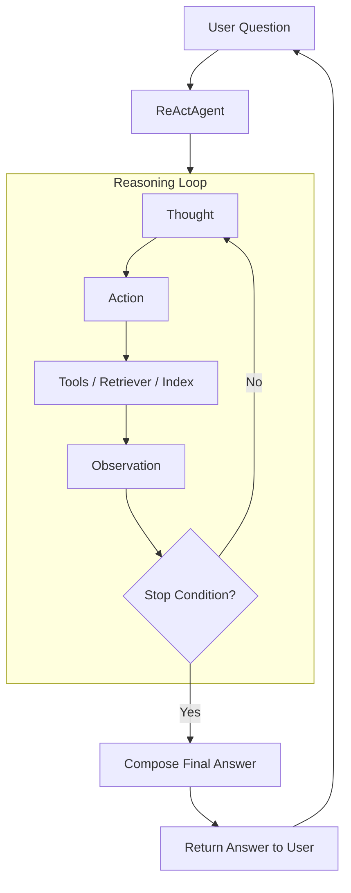

```mermaid
flowchart TD
  A[User Question] --> B[ReActAgent]

  %% Explicit loop
  subgraph L[Reasoning Loop]
    C1[Thought] --> C2[Action]
    C2 --> G[Tools / Retriever / Index]
    G --> C3[Observation]
    C3 --> D{Stop Condition?}
    D -- No --> C1
  end

  B --> L
  D -- Yes --> E[Compose Final Answer]
  E --> F[Return Answer to User]
  F --> A

```